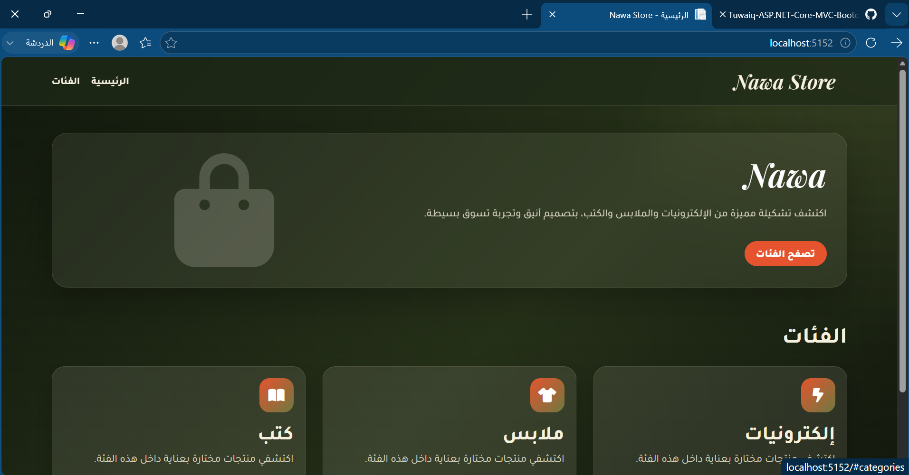
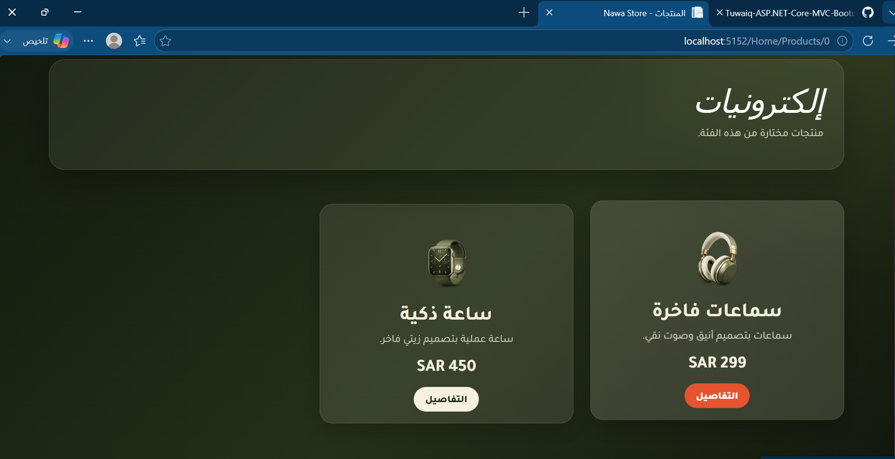
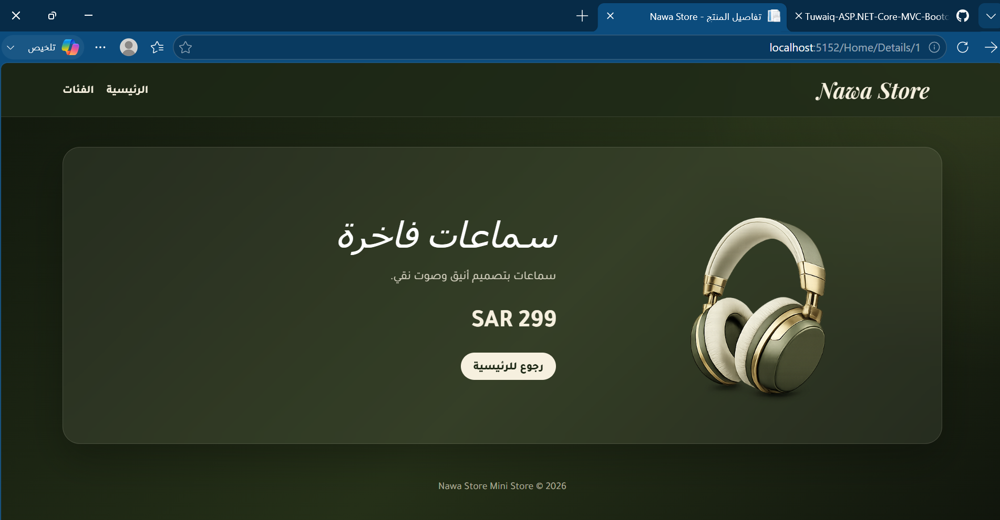

# Nawa Store

## نبذة عن المشروع

Nawa Store هو متجر إلكتروني مصغر تم تطويره باستخدام ASP.NET Core MVC ضمن مشروع معسكر أكاديمية طويق.

يعرض المشروع المنتجات من خلال ثلاث فئات رئيسية، مع إمكانية استعراض المنتجات الخاصة بكل فئة والانتقال إلى صفحة تفاصيل المنتج.

---

## الفئات

- إلكترونيات
- ملابس
- كتب

---

## مميزات المشروع

- عرض الفئات الرئيسية.
- عرض المنتجات حسب الفئة.
- صفحة مستقلة لتفاصيل كل منتج.
- تصميم متجاوب باستخدام Bootstrap 5.
- واجهة مستخدم بتصميم عصري وألوان زيتية.
- تنظيم المشروع وفق نمط MVC.

---

## التقنيات المستخدمة

- ASP.NET Core MVC
- C#
- Bootstrap 5
- HTML5
- CSS3
- Font Awesome

---
## صور المشروع

<h3>الصفحة الرئيسية</h3>



<h3>صفحة المنتجات</h3>



<h3>صفحة تفاصيل المنتج</h3>



---

## هيكل المشروع

```text
Controllers/
Models/
Views/
wwwroot/
├── css/
├── images/
└── js/
```

---

## طريقة تشغيل المشروع

```bash
dotnet restore
dotnet watch run
```

بعد تشغيل المشروع افتح الرابط الذي يظهر في نافذة Terminal داخل المتصفح.

---
